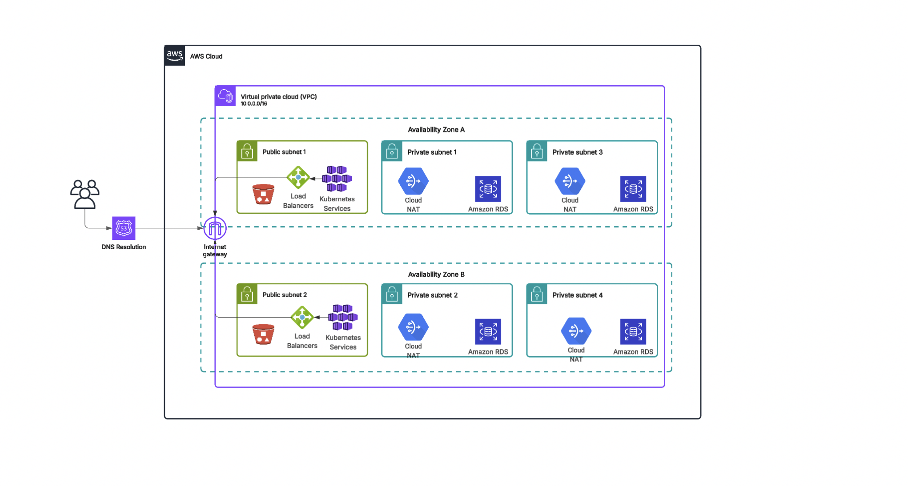

# Cloud & DevOps Engineer Documentation Template

This comprehensive documentation scaffold is designed to support Cloud and DevOps Engineers in organizing and sharing project knowledge effectively. It provides a structured format for documenting infrastructure setup, automation scripts, CI/CD pipelines, observability, runbooks, and tool configurations.

---

## 1. Infrastructure Overview

### Architecture Diagram
Provide a high-level visual diagram that illustrates the cloud infrastructure setup. Use tools like Lucidchart or draw.io to design a diagram that outlines the key components, such as VPCs, subnets, instances, databases, and load balancers.

```

```

### Cloud Resources
Document the core cloud resources provisioned for the project:
- **VPC CIDR**: Main address space (e.g., `10.0.0.0/16`)
- **Public Subnets**: For internet-facing resources (e.g., `10.0.1.0/24`, `10.0.2.0/24`)
- **Private Subnets**: For internal services (e.g., `10.0.10.0/24`, `10.0.20.0/24`)
- **EKS Cluster**: Kubernetes orchestration (e.g., `t2s-eks-cluster`)
- **RDS Instance**: PostgreSQL with Multi-AZ for high availability

### Security
Detail the cloud security configurations:
- **IAM Roles**: Defined in `modules/security/iam.tf` for resource access management
- **Security Groups**: Firewall rules in `modules/networking/security-groups.tf`
- **Web Application Firewall (WAF)**: Protects against common web threats using AWS WAF v2

---

## 2. Infrastructure as Code (IaC)

### Directory Structure
Organize Terraform modules and environments clearly:
```
terraform/
├── modules/          # Reusable modules for infrastructure components
│   ├── vpc/          # VPC setup
│   ├── eks/          # Kubernetes cluster setup
│   ├── rds/          # Relational database configuration
│   └── alb/          # Application Load Balancer
├── environments/     # Per-environment configuration
│   ├── dev/
│   ├── stage/
│   └── prod/
├── variables.tf      # Input variables
├── main.tf           # Main infrastructure logic
├── outputs.tf        # Output values
└── terraform.tfvars  # Variable values
```

### State Management
Use remote backend storage to manage Terraform state files:
- **S3 Bucket**: `devops-tfstate` to store the state file securely
- **DynamoDB Table**: `terraform-locks` for state locking and consistency

### Terraform Workflow
```bash
terraform init                            # Initialize provider plugins and backend
terraform plan -var-file=dev.tfvars       # Preview changes for dev environment
terraform apply -var-file=dev.tfvars      # Apply the changes to provision resources
```

---

## 3. CI/CD Pipeline

### Tools Used
- **GitHub Actions / Jenkins / GitLab**: For automation and deployment pipelines
- **Docker & ECR**: Container image building and storage
- **Helm & EKS**: Deployment of containerized apps to Kubernetes
- **Trivy**: Container image vulnerability scanning

### Sample Workflow
A GitHub Actions workflow to build and deploy an application to EKS:
```yaml
name: Deploy to EKS

on:
  push:
    branches: [ main ]

jobs:
  build-deploy:
    runs-on: ubuntu-latest
    steps:
      - name: Checkout code
        uses: actions/checkout@v3

      - name: Build & Push Docker Image
        run: |
          docker build -t my-app .
          docker tag my-app:latest $ECR_URL/my-app:latest
          docker push $ECR_URL/my-app:latest

      - name: Deploy to EKS
        run: helm upgrade --install my-app ./helm-chart
```

---

## 4. Monitoring & Logging

### Observability Stack
- **Prometheus**: Collects metrics from Kubernetes workloads
- **Grafana**: Visualizes time-series data using Prometheus
- **ELK Stack or Datadog**: Centralizes logs from all services
- **Alertmanager**: Routes alerts via email, Slack, etc.

### Common Alerts
Set up monitoring alerts to detect and respond to anomalies:
- CPU utilization > 80% sustained for 5 minutes
- Memory usage > 85%
- Disk utilization for RDS exceeds 90%

---

## 5. Runbooks

### Example Runbook: Pod CrashLoopBackOff
Create detailed troubleshooting guides for recurring issues:
```markdown
## Problem:
Pod is restarting repeatedly in CrashLoopBackOff state on EKS

## Steps to Resolve:
1. Inspect logs using: `kubectl logs <pod-name>`
2. Identify root cause: memory issues, bad image, etc.
3. Verify container resource requests and limits
4. Restart pod or re-deploy with fixes
5. Escalate to DevOps lead if unresolved after 15 minutes
```

---

## 6. README Template

Create a README.md file in your project root to onboard developers quickly:
```markdown
# Project Name

## Description
This project provisions infrastructure and application components using Terraform and Kubernetes.

## Requirements
- Terraform >= 1.5
- AWS CLI
- kubectl

## Setup Instructions
```bash
cd terraform/environments/dev
terraform init
terraform apply
```

## CI/CD
CI/CD pipeline is configured in `.github/workflows/deploy.yml`

## Observability
Refer to Grafana dashboard for metrics and Alertmanager for alerts.
```

---

## 7. Best Practices

- Use remote state for Terraform with locking
- Always pin Terraform provider versions
- Apply principle of least privilege with IAM
- Break down Terraform code into reusable modules
- Define lifecycle rules for storage buckets
- Keep secrets out of version control (use SSM or GitHub Secrets)

---

## 8. Tools Reference
| Area         | Tools                      |
|--------------|-----------------------------|
| IaC          | Terraform, CloudFormation   |
| CI/CD        | GitHub Actions, Jenkins     |
| Containers   | Docker, Kubernetes, Helm    |
| Monitoring   | Prometheus, Grafana, ELK    |
| Security     | Trivy, IAM, WAF             |

---

> This template can be stored in GitHub, Notion, Confluence, or your GitOps documentation folder for version-controlled access and collaboration.

--- 

## <div align="center">About the Author</div>

<div align="center">
  
</div>

**Emmanuel Naweji** is a seasoned Cloud and DevOps Engineer with years of experience helping companies architect and deploy secure, scalable infrastructure. He is the founder of initiatives that train and mentor individuals seeking careers in IT and has helped hundreds transition into Cloud, DevOps, and Infrastructure roles.

- Book a free consultation: [https://here4you.setmore.com](https://here4you.setmore.com)
- Connect on LinkedIn: [https://www.linkedin.com/in/ready2assist/](https://www.linkedin.com/in/ready2assist/)

Let's connect and discuss how I can help you build reliable, automated infrastructure the right way.


——

MIT License © 2025 Emmanuel Naweji

You are free to use, copy, modify, merge, publish, distribute, sublicense, or sell copies of this software and its associated documentation files (the “Software”), provided that the copyright and permission notice appears in all copies or substantial portions of the Software.

This Software is provided “as is,” without any warranty — express or implied — including but not limited to merchantability, fitness for a particular purpose, or non-infringement. In no event will the authors be liable for any claim, damages, or other liability arising from the use of the Software.

